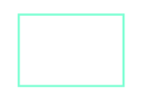
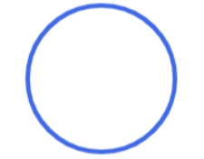
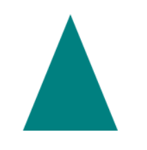
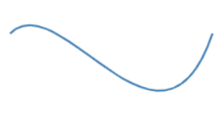

<h1> Projeto de Desenho de Formas no Canvas </h1>

<h2> # índice </h2>
<ul>
  <li>Descrição do Projeto</li>
  <li>Estrutura do Projeto</li>
  <li>Formas do Canvas utilizadas</li>
</ul>

 

<h3> Descrição do projeto </h3>
 
 Este é um projeto de exemplo que demonstra como criar e desenhar formas no elemento <em><strong><canvas></strong></em>  utilizando JavaScript. O objetivo é fornecer uma compreensão básica de como utilizar o Canvas para criar formas gráficas e imagens. 

  
   
  
<h3> Estrutura do Projeto </h3>
  
 
   - <em>index.html</em> -> Contém o elemento <canvas> e carrega o arquivo JavaScript.  
   - <em>script.js</em> -> Contém o código para criar e desenhar as formas no canvas.  
   - <em>img/punk.png</em> -> Pasta que contém a imagem.  
   - <em>css.style</em> -> Contém o código que arruma a imagem  
   - <em>img/punk.png</em> -> Pasta que contém a imagem. 
  

  
   

<h3> Formas do Canvas utilizadas </h3>

  
 <h4>Retângulo</h4> --> Demonstração de como criar um retângulo preenchido e contornado no canvas.

 
 
[ Código:  
ctx.strokeStyle = "aquamarine"; -> definindo a cor do contorno do desenho que é aquamarine.  
ctx.fillStyle = "white"; -> preenchendo a cor branca dentro no desenho.  
ctx.lineWidth = 2; -> tamanho da linha do contorno do desenho.  
ctx.fillRect (65,55,95,65); ->  e desenha um retângulo preenchido no canvas, começando nas coordenadas (65, 55) e tendo uma largura de 95 unidades e uma altura de 65 unidades.  
ctx.strokeRect (65,55,95,65); -> para desenhar o contorno do desenho usando as mesmas coordenadas do preenchimento.  
]   
  

   

 
<h4>Círculo</h4> --> Demonstração de como criar um círculo preenchido no canvas.

   

[ Código:   
ctx3.strokeStyle = "royalblue"; -> definindo a cor do contorno que é azul realeza.  
ctx3.lineWidth = 4; -> largura da linha do conturno.  
ctx3.beginPath(); -> marcando o caminho do desenho. O caminho é uma sequencia de comandos especificando como o desenho será desenhado conforme as coordenadas.  
ctx3.arc(75, 75, 65, 0, Math.PI*2, false); -> desenhar um arco em um elemento canvas.  
ctx3.moveTo(110,85); -> movendo o ponto de início do caminho de desenho para as coordenadas. Isso define a posição inicial a partir da qual o desenho será feito.  
ctx3.stroke(); -> vai preencher com cor esse contorno, para que fique visivel.  
 ]   
     

   

  
  
 
 
<h4>Linhas</h4> --> Demonstração de como desenhar linhas retas e curvas usando os métodos <em><strong>moveTo()t</strong></em> e <em><strong>lineTo()</strong></em>.

   
 
[ Código:   
ctx4.strokeStyle = "purple"; -> definindo a cor da linha do contorno que é roxo.  
ctx4.lineWidth = 2; -> largura da linha do contorno.  
ctx4.moveTo(50,50); ->   movendo o ponto de início do caminho de desenho para coordenadas. Isso define a posição inicial a partir da qual o desenho será feito.
ctx4.lineTo(265,150); -> desenha uma linha no canvas do ponto atual do cursor até as coordenadas (265, 150).  
ctx4.stroke(); -> vai preencher com cor esse contorno, para que fique visivel.
]   
  

   

  
  

<h4>Triângulo</h4> --> Demonstração de como desenhar um triângulo preenchido no canvas.
 
   

[ Código:   ctx2.beginPath(); -> iniciando o caminho do desenho que será traçado.  
ctx2.moveTo(120,15); -> movendo o ponto de início do caminho de desenho para as coordenadas (120, 15). Isso define a posição inicial a partir da qual o desenho será feito.  
ctx2.lineTo(65,150); -> traçando uma linha reta do ponto atual do caminho de desenho (120, 15) até as coordenadas (65, 150). Isso cria uma linha que conecta esses dois pontos.  
ctx2.lineTo(175,150); -> traçando outra linha reta do ponto atual do caminho de desenho (65, 150) até as coordenadas (175, 150). Isso cria uma segunda linha que conecta o ponto anterior a esse novo ponto.  
ctx2.fill(); -> vai preencher com cor esse contorno, para que fique visivel. 
]    
     ]  

   

  

<h4>Curva de Bezier</h4> --> Demonstração de como desenhar uma curva de Bezier usando o método  <em><strong>bezierCurveTo()</strong></em>.

   

[ Código:   ctx5.strokeStyle = "steelblue"; -> definindo a cor da linha do contorno que é steelblue.  
ctx5.lineWidth = 2; -> largura da linha do contorno  
ctx5.moveTo(50, 50); -> move o cursor para a posição (50, 50) no canvas, preparando-se para desenhar a partir dessa nova posição.  
ctx5.bezierCurveTo(100, 0, 200, 200, 250, 50); ->  desenha uma curva de Bezier cúbica em um elemento canvas.  
ctx5.stroke(); -> vai preencher com cor esse contorno, para que fique visivel.   
]   
  

   

  

<h4>Imagem</h4> --> Demonstração de como exibir uma imagem no canvas utilizando o método  <em><strong>drawImage()</strong></em>

   
 
[ Código:   const img = new Image(); ->  criando um novo objeto de imagem usando o construtor Image(). Esse objeto de imagem será usado para carregar e exibir a imagem no canvas.  
img.src = "img/punk.png"; -> chamando a imagem na pasta.  
img.onload = function () { -> função criada para desenhar a imagem na tela.  
  ctx6.drawImage(img, 0, 0); -> desenhando a imagem conforme as coordenadas.
};   
]   
  

   

  

